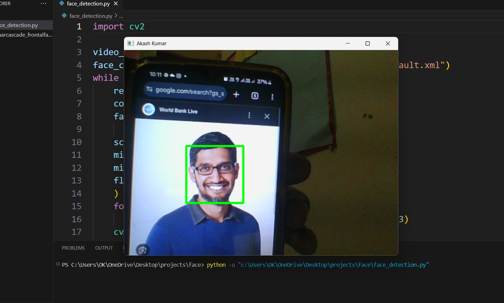

🖥️ Real-Time Face Detection

This Python project uses OpenCV and the Haar Cascade Classifier to detect faces in real time using your webcam.
It draws rectangles around detected faces and updates the display live.

## 📸 Screenshot

📌 Features

Real-time face detection using webcam

Uses haarcascade_frontalface_default.xml pre-trained model

Simple, fast, and lightweight implementation

Highlights detected faces with colored rectangles

📂 Requirements

Make sure you have the following installed:

pip install opencv-python

Also, download the haarcascade_frontalface_default.xml file from OpenCV’s GitHub or place it in the same folder as your script.

🚀 How to Run

Clone the repository or download the script.

Place the Haar Cascade XML file in the same folder.

Run the script:

python face_detection.py

Press Spacebar to close the window.
